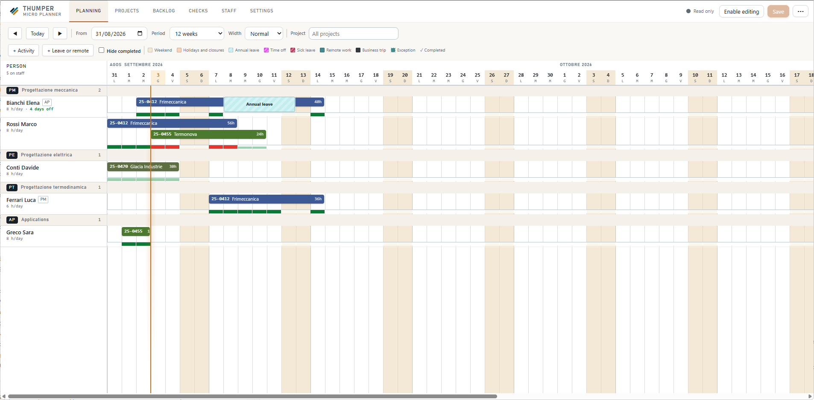
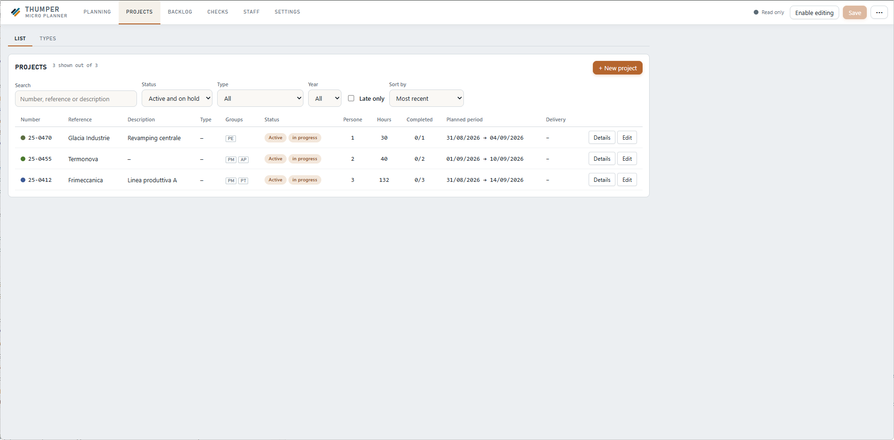
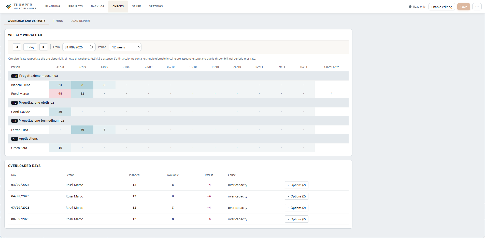
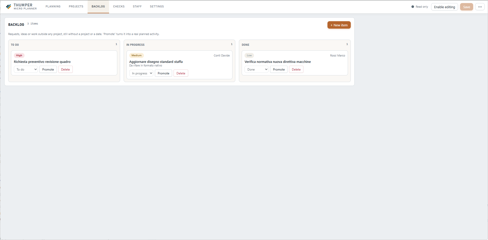
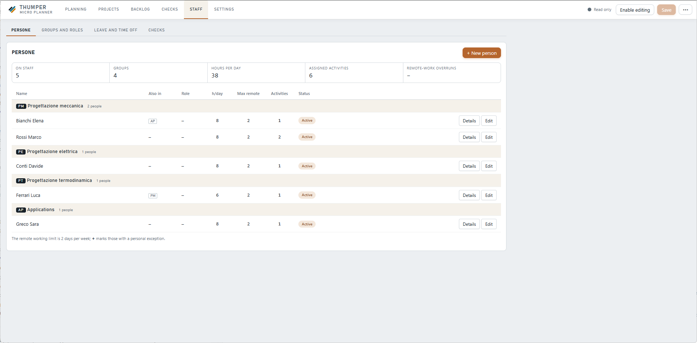
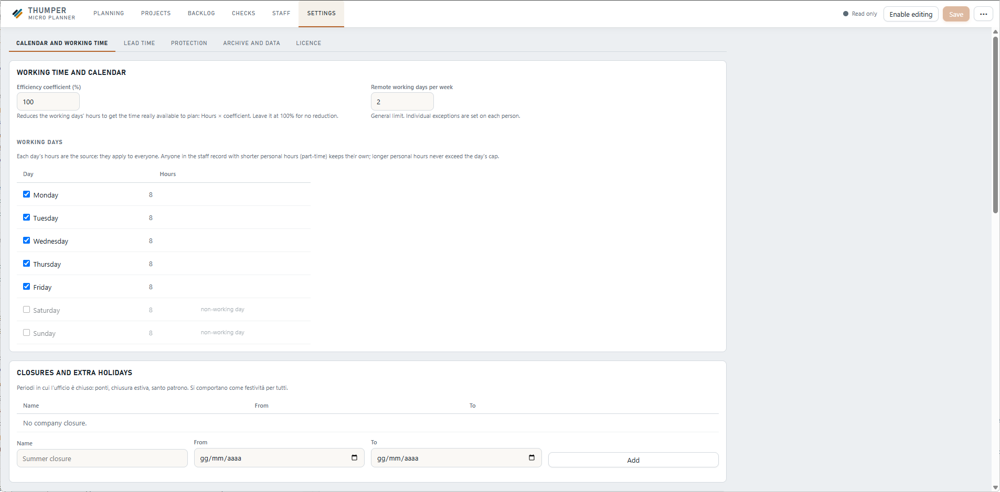
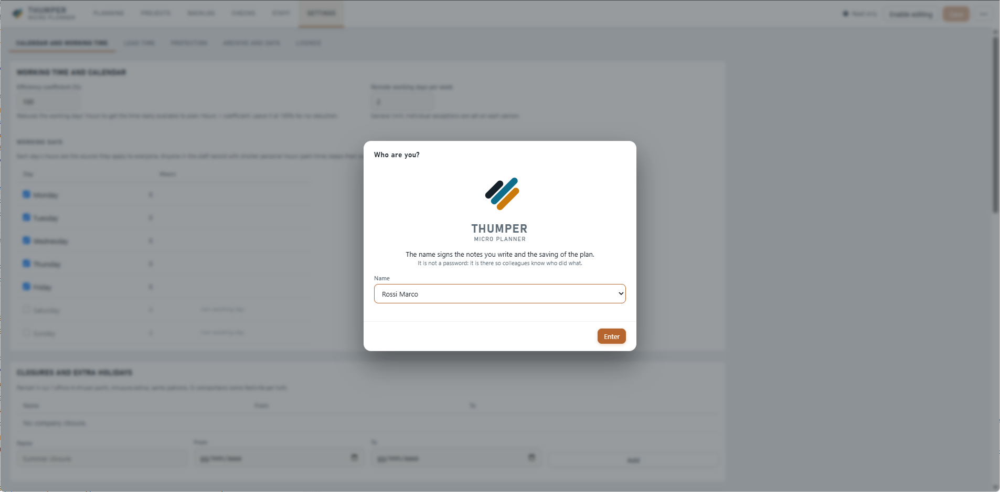

# Thumper — Micro Planner

**Pianificazione e gestione progetti per piccoli team, senza server, senza installazione, senza scuse.**
**Project planning and resource management for small teams — no server, no install, no excuses.**

🇮🇹 [Italiano](#italiano) · 🇬🇧 [English](#english)

> ⚠️ **Stato del progetto / Project status**: in sviluppo attivo, usato quotidianamente in produzione da un piccolo team — le interfacce e il modello dati possono ancora cambiare. / Actively developed and used daily in production by a small team — interfaces and data model may still change.



<details>
<summary><b>Altri screenshot / More screenshots</b></summary>
<br>

| | |
|---|---|
| <br>Elenco progetti / Project list | <br>Carico di lavoro e sovraccarichi / Workload & overloaded days |
| <br>Backlog Kanban | <br>Organico e gruppi / Staff & groups |
| <br>Impostazioni / Settings | <br>"Chi sei?" all'avvio / "Who are you?" on launch |

</details>

---

## Italiano

### Indice

- [Perché Thumper](#perché-thumper)
- [Funzionalità principali](#funzionalità-principali)
- [Quick start](#quick-start)
- [Come funziona la persistenza dei dati](#come-funziona-la-persistenza-dei-dati)
- [Stack tecnico e vincoli di progetto](#stack-tecnico-e-vincoli-di-progetto)
- [Struttura del repository](#struttura-del-repository)
- [Roadmap](#roadmap)
- [Documentazione](#documentazione)
- [Contribuire](#contribuire)
- [Licenza](#licenza)

Thumper è una web app *client-side* per pianificare chi lavora su cosa, in quali giorni, e se il tempo a disposizione basta. Nasce per sostituire il classico file Excel condiviso che tutti modificano e nessuno controlla, in un team diviso in più gruppi o reparti.

Gira aprendo un singolo file HTML **direttamente dal browser**, anche da una cartella di rete Windows via `file://`. Nessun server, nessun build, nessuna dipendenza esterna: solo HTML, CSS e JavaScript vanilla.

### Perché Thumper

Molti piccoli team pianificano il lavoro con un foglio Excel condiviso su una cartella di rete: funziona finché il team è piccolo, poi degenera — celle sovrascritte, nessuno vede i sovraccarichi finché non è tardi, nessuna verifica sulle scadenze.

Thumper affronta lo stesso problema con lo stesso vincolo di partenza (una cartella di rete, zero budget, zero permessi di installazione), ma con:

- una vista di pianificazione pensata per essere letta a colpo d'occhio;
- controlli automatici su sovraccarichi e scadenze, invece di scoprirli a consuntivo;
- una sola fonte di verità (`dati.js`), con backup automatici e protezione dai salvataggi concorrenti.

Non è pensato per grandi organizzazioni con PMO strutturati: è deliberatamente uno strumento leggero, per team che oggi non hanno nulla di meglio di un Excel condiviso.

### Funzionalità principali

- **Pianificazione a calendario** — vista Gantt-like per persona, raggruppata per gruppo/reparto, con scorrimento temporale e filtro per progetto.
- **Tre modalità di pianificazione per attività**: data di inizio con calcolo automatico della fine, scadenza di consegna con calcolo a ritroso della data di inizio, oppure carico ripartito su un intervallo.
- **Rilevamento sovraccarichi** basato su statistiche robuste (mediana e MAD, non media) invece di soglie fisse.
- **Gestione assenze e smart working**, con permessi parziali che riducono la capacità giornaliera senza bloccarla.
- **Backlog in stile Kanban** per il lavoro non ancora pianificato (nessuna data, nessun progetto assegnato), con promozione a vera attività quando è il momento.
- **Gestore documenti e note per progetto**, in Markdown.
- **Report di carico di lavoro** con esportazione CSV.
- **Sistema di lead time e scadenze di consegna**, per capire in anticipo se una data è realistica.
- **Interfaccia bilingue** italiano/inglese.
- **Sola lettura di default**: modifica esplicita da attivare, per evitare modifiche accidentali con un clic distratto.

### Quick start

Nessuna installazione, nessun `npm install`.

1. Clona o scarica il repository.
2. Apri `Thumper.html` con un doppio clic (browser consigliati: **Chrome** o **Edge**, per il supporto alla File System Access API).
3. Al primo avvio ti verrà chiesto chi sei — non è un login, serve solo a firmare le note e i salvataggi.
4. L'app parte già popolata con dati dimostrativi (`dati.js` non è incluso nel repository: è lo stato applicativo, non sorgente).

Per usarlo in team, basta mettere la cartella su una condivisione di rete Windows: ogni collega apre lo stesso `Thumper.html` dal proprio browser.

### Come funziona la persistenza dei dati

Non c'è un database e non c'è un backend. Tutto il piano vive in un unico file, `dati.js`, accanto a `Thumper.html`.

- Il salvataggio usa la **File System Access API** del browser: la prima volta chiede dove si trova `dati.js`, poi scrive direttamente senza altre richieste.
- Ogni salvataggio mette da parte la versione precedente in `backup/`, tenendo le ultime cinque.
- Se un collega ha salvato nel frattempo, il salvataggio si **ferma** con un avviso invece di sovrascrivere silenziosamente: un solo scrittore alla volta, niente merge automatico.
- Sui browser senza supporto alla File System Access API, il salvataggio scarica `dati.js` nella cartella Download, da spostare a mano nella cartella di rete.

### Stack tecnico e vincoli di progetto

Thumper è costruito attorno a un vincolo preciso, non aggirabile: deve girare da una cartella di rete via `file://`, su macchine dove non si può installare nulla.

- **HTML + CSS + JavaScript vanilla** — nessun framework, nessuna libreria esterna, nessuna dipendenza caricata da CDN.
- **Nessun build step** — i file si editano ed eseguono così come sono.
- **Nessun modulo ES** — i moduli falliscono per CORS su `file://`; tutti gli script sono `<script src="...">` classici, in scope globale condiviso, caricati in ordine fisso.
- **Persistenza** via File System Access API del browser, non `localStorage` (inaffidabile su `file://`).

### Struttura del repository

```
Thumper.html            — markup dell'app (schede, barra, contenitori)
stile.css                — foglio di stile principale (variabili CSS per temi/colori)
dizionario.js            — stringhe di interfaccia IT→EN
dati.js                   — stato applicativo corrente (non tracciato in git)
manuale.html              — manuale utente, pagina statica bilingue
js/                        — tutta la logica applicativa, un file per area
LICENSE                    — AGPL-3.0
LICENZA-COMMERCIALE.md     — termini della licenza commerciale alternativa
```

### Roadmap

Il progetto è pensato per evolvere in quattro varianti:

1. **Thumper std** — la versione attuale, `file://`-based *(attiva)*
2. **Thumper Scrum** — variante specializzata Scrum sullo stesso sistema dati, con sprint, story point, velocity
3. **Thumper std + DB** — versione standard con database dedicato, eventualmente containerizzata
4. **Thumper Scrum + DB** — come sopra, versione Scrum

Le funzionalità di utilità generale (come il backlog) vengono integrate prima nel nucleo comune, poi specializzate nelle varianti.

### Documentazione

- [`manuale.html`](manuale.html) — manuale utente, in italiano e inglese

### Contribuire

Il progetto nasce per un caso d'uso reale in azienda, quindi le decisioni di prodotto restano guidate da quello, ma segnalazioni di bug, idee e pull request sono benvenute. Prima di proporre una modifica sostanziale, apri una issue per discuterne: i vincoli architetturali (vedi sopra) non sono negoziabili, tutto il resto sì.

### Licenza

Distribuito con licenza **AGPL-3.0** (vedi [LICENSE](LICENSE)).

È disponibile anche una **licenza commerciale alternativa** per usi che l'AGPL non consente — ad esempio incorporare il programma in un prodotto proprietario o rivenderlo senza rilasciare il sorgente. Vedi [LICENZA-COMMERCIALE.md](LICENZA-COMMERCIALE.md) per i dettagli, o contatta l'autore.

---

## English

### Table of contents

- [Why Thumper](#why-thumper)
- [Key features](#key-features)
- [Quick start (EN)](#quick-start-en)
- [How data persistence works](#how-data-persistence-works)
- [Tech stack and design constraints](#tech-stack-and-design-constraints)
- [Repository structure](#repository-structure)
- [Roadmap (EN)](#roadmap-en)
- [Documentation](#documentation)
- [Contributing](#contributing)
- [License](#license)

Thumper is a *client-side* web app for planning who works on what, on which days, and whether there's enough time to go around. It was built to replace the classic shared Excel file that everyone edits and no one really controls, across a team split into several groups or departments.

It runs by opening a single HTML file **directly in the browser** — even from a Windows network share over `file://`. No server, no build step, no external dependency: just vanilla HTML, CSS and JavaScript.

### Why Thumper

Many small teams plan their work with an Excel file shared over a network drive: it works while the team is small, then it falls apart — overwritten cells, overloads nobody notices until it's too late, no real check on deadlines.

Thumper tackles the same problem under the same starting constraints (a network folder, zero budget, no install permissions), but adds:

- a planning view designed to be read at a glance;
- automatic overload and deadline checks, instead of finding out after the fact;
- a single source of truth (`dati.js`), with automatic backups and protection against concurrent saves.

It isn't built for large organizations with a structured PMO: it's deliberately a lightweight tool, for teams that today have nothing better than a shared spreadsheet.

### Key features

- **Calendar-based planning** — a Gantt-like view per person, grouped by team/department, with time scrolling and project filtering.
- **Three scheduling modes per activity**: a start date with automatic end-date calculation, a delivery deadline with backward calculation of the start date, or a workload spread evenly across a date range.
- **Overload detection** based on robust statistics (median and MAD, not the mean) instead of fixed thresholds.
- **Absence and remote-work management**, with partial leave that reduces daily capacity without blocking it.
- **Kanban-style backlog** for work that hasn't been scheduled yet (no date, no project assigned), promoted to a real activity when the time comes.
- **Document and note manager per project**, in Markdown.
- **Workload reports** with CSV export.
- **Lead time and delivery-deadline system**, to spot early whether a date is realistic.
- **Bilingual interface**, Italian/English.
- **Read-only by default**: editing must be turned on explicitly, to avoid accidentally moving something with a stray click.

### Quick start (EN)

No installation, no `npm install`.

1. Clone or download the repository.
2. Open `Thumper.html` with a double click (recommended browsers: **Chrome** or **Edge**, for File System Access API support).
3. On first launch you'll be asked who you are — it's not a login, it's just used to sign notes and saves.
4. The app starts pre-loaded with demo data (`dati.js` isn't included in the repository: it's application state, not source code).

To use it as a team, just put the folder on a Windows network share: each colleague opens the same `Thumper.html` from their own browser.

### How data persistence works

There's no database and no backend. The whole plan lives in a single file, `dati.js`, next to `Thumper.html`.

- Saving uses the browser's **File System Access API**: the first time, it asks where `dati.js` is located, then writes to it directly with no further prompts.
- Every save moves the previous version into a `backup/` folder, keeping the last five.
- If a colleague has saved in the meantime, your save **stops** with a warning instead of silently overwriting: one writer at a time, no automatic merging.
- On browsers without File System Access API support, saving downloads `dati.js` to the Downloads folder, to be moved by hand into the network folder.

### Tech stack and design constraints

Thumper is built around one hard constraint: it has to run from a network folder over `file://`, on machines where nothing can be installed.

- **Vanilla HTML + CSS + JavaScript** — no framework, no external library, no dependency loaded from a CDN.
- **No build step** — files are edited and run exactly as they are.
- **No ES modules** — modules fail under CORS on `file://`; every script is a classic `<script src="...">` tag, sharing a global scope, loaded in a fixed order.
- **Persistence** via the browser's File System Access API, not `localStorage` (unreliable on `file://`).

### Repository structure

```
Thumper.html            — app markup (tabs, toolbar, containers)
stile.css                — main stylesheet (CSS custom properties for themes/colors)
dizionario.js            — UI strings, IT→EN
dati.js                   — current application state (not tracked in git)
manuale.html              — user manual, static bilingual page
js/                        — all application logic, one file per area
LICENSE                    — AGPL-3.0
LICENZA-COMMERCIALE.md     — terms of the alternative commercial license
```

### Roadmap (EN)

The project is designed to grow into four variants:

1. **Thumper std** — the current version, `file://`-based *(active)*
2. **Thumper Scrum** — a Scrum-specialized variant on the same data system, adding sprints, story points, velocity
3. **Thumper std + DB** — the standard version backed by a dedicated database, possibly containerized
4. **Thumper Scrum + DB** — same as above, Scrum version

Generally useful features (like the backlog) are integrated into the shared core first, then specialized within each variant.

### Documentation

- [`manuale.html`](manuale.html) — user manual, in Italian and English

### Contributing

The project was born to solve a real use case at a company, so product decisions stay grounded in that, but bug reports, ideas and pull requests are welcome. Before proposing a substantial change, please open an issue to discuss it: the architectural constraints (see above) are non-negotiable, everything else is.

### License

Distributed under the **AGPL-3.0** license (see [LICENSE](LICENSE)).

An **alternative commercial license** is also available for uses that AGPL doesn't allow — for example, embedding the program in a proprietary product or reselling it without releasing the source. See [LICENZA-COMMERCIALE.md](LICENZA-COMMERCIALE.md) for details, or contact the author.
